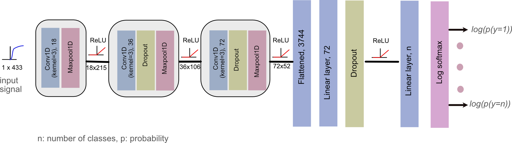

# HSI Analysis ML
Convolutional Neural Networks and traditional machine learning methods for hyper-spectral imaging data

**Contributors:** Sharib Ali <s.s.ali@leeds.ac.uk>, Dale Waterhouse <djw93@cam.ac.uk>

#### Requirements

- 	Linux/Unix only
- 	pyTorch >1.5
- 	CUDA > 10.0
- 	scikit-learn
-  matplotlib
-  datatable

#### Data preparation
[Download the preparaed data](https://drive.google.com/file/d/10iwzBT5tgsmqQXZ1LaOi3QP2axjNPP4E/view?usp=sharing)

#### Training/testing classical machine learning approaches
`run script_run_classical_ML.sh`

- Internal setup for 2 class: 
`nClasses=2
dataType='noExclusion'`

- Internal setup for 3 class: 
`nClasses=3
dataType='noExclusion' `

- dataType choices `==> [noExclusion(default), withExclusion, balanced]`

Includes:
- LDA
- QDA
- KNN
- SVM (with rbf kernel set)

#### Training a deep learning model
- For 3 class 1D CNN classsification
	`run script_train.sh`
	
- For 2 class 1D CNN classification
	`run sccript_train_2class.py`
	
- For both dataType choices `==> [noExclusion(default), withExclusion, balanced]`
 
#### Testing a deep learning model
- For both 2 class and 3 class:
`run script_test.sh`

- Internal setup: `nclass = 2/3, dataType=[noExclusion(default), withExclusion, balanced]`

#### Cite this work as:
Dale J. Waterhouse, Wladyslaw Januszewicz, Sharib Ali, Rebecca C. Fitzgerald, Massimiliano di Pietro, Sarah E. Bohndiek; Spectral Endoscopy Enhances Contrast for Neoplasia in Surveillance of Barrett's Esophagus. Cancer Res 15 June 2021; 81 (12): 3415–3425. https://doi.org/10.1158/0008-5472.CAN-21-0474
